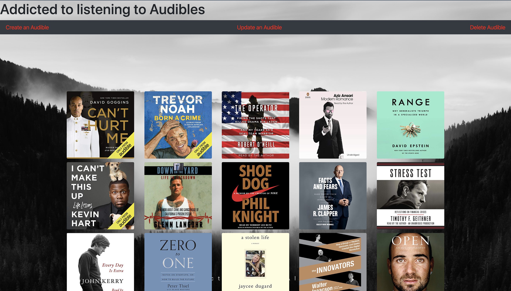

## Audible Tracker

Iv been listening to audibles for a few years and have collected over 50+ books.
This application allows a user to se my collection and add,edit,delete an audible in my library.
Take a peak into my collection and add a book to my list!A

## Home Page

## Live Website

http://mattaldrete.com/apps/Audible/

### Technologies & Tools Used

- Java,
- Spring Boot,
- Gradle,
- JPA, SQL,
- MySQL,
- JSPS.
- HTML, CSS, Javascript, Bootstrap

### Lessons Learned

Build wire frame front end page designs for better layout. I built very differnt looking pages for create, update and delete next time I will spend more time planning the front end layout so design is set and is the same across the site.
